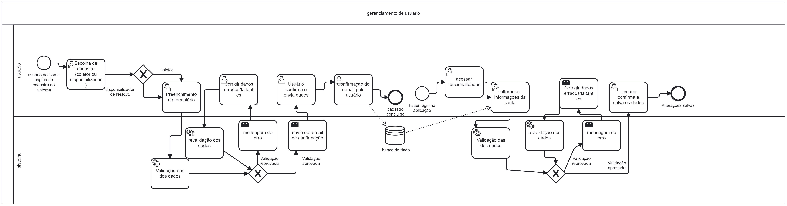

### 3.3.3 Processo 3 – Processo de Cadastro de Usuário

Para um usuário realizar seu cadastro na plataforma, ele deve inicialmente escolher entre duas opções: coletor ou disponibilizador de resíduos. O sistema visa facilitar esse processo, permitindo que o usuário preencha um formulário adequado à sua escolha. Após o preenchimento, o sistema realiza uma validação automática dos dados. Caso sejam identificados erros ou informações faltantes, o usuário recebe uma mensagem de erro para correção.

Uma vez que os dados estejam corretos e validados, o sistema envia um e-mail de confirmação para que o usuário conclua o processo de cadastro. Após a confirmação do e-mail, o usuário tem acesso à plataforma e suas funcionalidades.

Se em algum momento o usuário desejar alterar suas informações, ele poderá fazê-lo através da plataforma. As novas informações serão novamente submetidas à validação, garantindo que os dados estejam sempre corretos e atualizados. O sistema, assim, garante uma interação contínua e eficiente, tanto para coletores quanto para disponibilizadores de resíduos, assegurando que as informações sejam mantidas de forma precisa para otimizar a experiência de todos os usuários.

#### Detalhamento das atividades

---

### **Detalhamento das Atividades**

#### **Escolha de Cadastro**

| Campo        | Tipo             | Restrições                    | Valor Default   |
|--------------|------------------|-------------------------------|-----------------|
| coletor      | Botão de seleção  | Obrigatório escolher um       | Nenhum          |
| disponibilizador | Botão de seleção | Obrigatório escolher um     | Nenhum          |

- **Comandos:**  
  - **entrar**: Direciona para preenchimento de formulário do coletor  
  - **cadastrar**: Direciona para preenchimento de formulário do disponibilizador  

---

#### **Preenchimento de Formulário**

| Campo             | Tipo               | Restrições                 | Valor Default   |
|-------------------|--------------------|----------------------------|-----------------|
| Dados pessoais    | Caixa de texto      | Campos obrigatórios        | Nenhum          |
| Local de coleta   | Caixa de texto      | Obrigatório para coletores | Nenhum          |
| Informações sobre resíduos | Caixa de texto | Obrigatório para disponibilizadores | Nenhum          |

- **Comandos:**  
  - **enviar**: Inicia o processo de validação dos dados  

---

#### **Validação dos Dados**

| Campo             | Tipo               | Restrições                 | Valor Default   |
|-------------------|--------------------|----------------------------|-----------------|
| -                 | -                  | -                          | -               |

- **Comandos:**  
  - **validação aprovada**: Prossegue para confirmação por e-mail  
  - **validação reprovada**: Retorna para correção dos dados  

---

#### **Correção de Dados Errados/Faltantes**

| Campo             | Tipo               | Restrições                 | Valor Default   |
|-------------------|--------------------|----------------------------|-----------------|
| Dados incorretos  | Caixa de texto      | Campos obrigatórios        | Últimos dados preenchidos |

- **Comandos:**  
  - **enviar correção**: Inicia nova validação dos dados corrigidos  

---

#### **Confirmação do E-mail**

| Campo             | Tipo               | Restrições                 | Valor Default   |
|-------------------|--------------------|----------------------------|-----------------|
| Link de confirmação | Link no e-mail   | Necessário clicar no link   | Nenhum          |

- **Comandos:**  
  - **confirmar e-mail**: Finaliza o processo de cadastro e ativa a conta  

---

#### **Acesso às Funcionalidades**

| Campo             | Tipo               | Restrições                 | Valor Default   |
|-------------------|--------------------|----------------------------|-----------------|
| -                 | -                  | -                          | -               |

- **Comandos:**  
  - **acessar sistema**: Acessa as funcionalidades disponíveis conforme o tipo de usuário  

---

#### **Alterar Informações da Conta**

| Campo             | Tipo               | Restrições                 | Valor Default   |
|-------------------|--------------------|----------------------------|-----------------|
| Dados alterados   | Caixa de texto      | Campos obrigatórios        | Dados atuais    |

- **Comandos:**  
  - **salvar alterações**: Inicia o processo de revalidação dos dados alterados  

---

#### **Revalidação dos Dados Alterados**

| Campo             | Tipo               | Restrições                 | Valor Default   |
|-------------------|--------------------|----------------------------|-----------------|
| -                 | -                  | -                          | -               |

- **Comandos:**  
  - **validação aprovada**: Confirma a alteração dos dados  
  - **validação reprovada**: Retorna para correção dos dados  

---

#### **Correção de Dados Alterados (se necessário)**

| Campo             | Tipo               | Restrições                 | Valor Default   |
|-------------------|--------------------|----------------------------|-----------------|
| Dados incorretos  | Caixa de texto      | Campos obrigatórios        | Dados incorretos inseridos |

- **Comandos:**  
  - **enviar correção**: Inicia nova validação dos dados corrigidos  

---

#### **Conclusão das Alterações**

| Campo             | Tipo               | Restrições                 | Valor Default   |
|-------------------|--------------------|----------------------------|-----------------|
| -                 | -                  | -                          | -               |

- **Comandos:**  
  - **salvar alterações**: Finaliza o processo de alteração e salva os novos dados  

---

