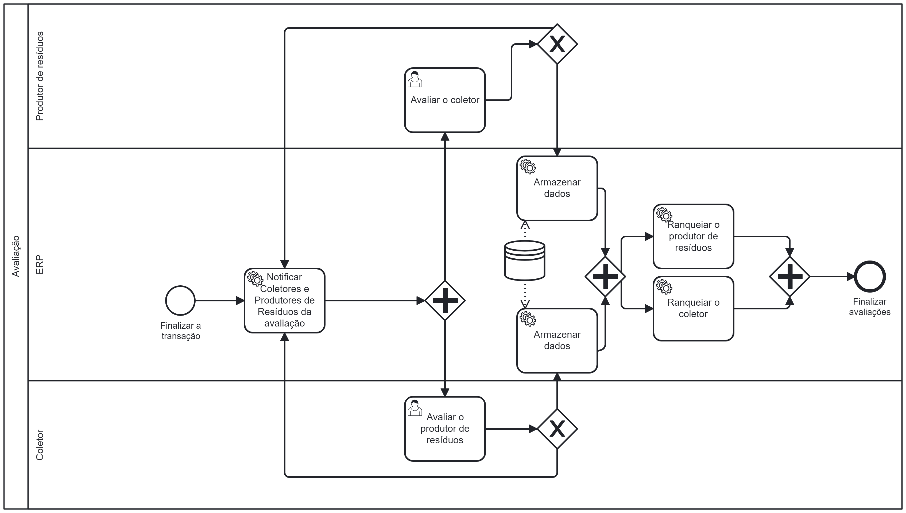

### 3.3.4 Processo 4 – Avaliação

Durante a fase de avaliação será possível que os Coletores avaliem como foi sua experiência com os produtores de resíduos e os produtores de resíduos poderão dar seu feedback do trabalho prestado pelos coletores. A avaliação mútua é fundamental para mantermos um Quality Assurance da plataforma. Através dos dados coletados nas avaliações, o sistema ranqueará os coletores melhores avaliados, bem como, os melhores fornecedores de resíduos. Este processo promove a confiança no serviço e ajuda na tomada de decisão dos novos usuários.

#### Detalhamento das atividades

Após a finalização da transação entre ambas as partes, o sistema seguirá os seguintes passos:

Notificação de Pendência:

O sistema notificará ambas as partes (produtores de resíduos e coletores) que há uma pendência a ser resolvida.
Tela de Avaliação para Produtores de Resíduos:

Quando os produtores de resíduos entrarem no sistema, eles serão recebidos com uma tela específica.
Nesta tela, os produtores deverão fornecer uma avaliação dos coletores que participaram da transação.
Tela de Avaliação para Coletores:

Da mesma forma, os coletores terão uma tela dedicada ao entrar no sistema.
Nessa tela, os coletores deverão avaliar os produtores de resíduos com quem lidaram.
Armazenamento e Cálculo dos Dados:

Após a conclusão das avaliações, os dados serão armazenados no banco de dados do sistema.
Cada usuário (produtores e coletores) terá seu ranking de avaliação calculado.
O cálculo do ranking será feito com base na média simples entre o número de avaliações recebidas e o valor atribuído nas avaliações.
Utilização dos Dados:

Os valores coletados das avaliações serão usados para:
Ranqueamento: Ordenar os usuários com base nas suas avaliações.
Filtragem: Facilitar a identificação e seleção de usuários de acordo com seu ranking e feedback.

| **Campo**       | **Tipo**         | **Restrições** | 
| ---             | ---              | ---            |                                
| Avaliação           | Selecionável   | pontuação de 1 a 5 |                
