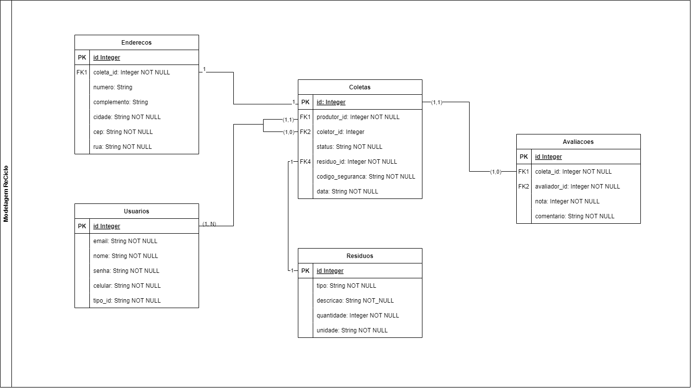

## 4. Projeto da solução

### 4.1. Modelo de dados

---

### 4.2. Tecnologias

1. **Banco de Dados**: 
   - **MariaDB**: Banco de dados relacional, compatível com MySQL, utilizado para armazenar dados de forma estruturada.

2. **Front end**: 
   - **HTML**: Estruturação do conteúdo da página.
   - **CSS**: Estilização visual e layout da aplicação.
   - **JavaScript**: Interatividade e manipulação do DOM.

3. **Back end**: 
   - **Java Spring Boot**: Framework para desenvolver aplicações Java de forma rápida e eficiente, oferecendo suporte a RESTful APIs e integração com o banco de dados.

4. **Deploy**: 
   - **GitHub Pages**: Serviço para hospedar a parte front end da aplicação, facilitando o acesso e a visualização do projeto.

- **IDE**: 
  - **Visual Studio Code**: Para desenvolvimento frontend em HTML, CSS e JavaScript, desenvolvimento backend em Java.

### Outros

- **Spring Data JPA**: Para simplificar a interação com o MariaDB.
- **Bootstrap**: Para acelerar a criação de layouts responsivos no front end.
- **Fetch API**: Para chamadas assíncronas no front end.

### Controle de versão

- **Git**: Para controle de versão do código e colaboração no projeto.

### Testes

- **JUnit**: Para testes unitários em Java.

Essas tecnologias proporcionarão uma aplicação robusta, escalável e de fácil manutenção.

| **Dimensão**   | **Tecnologia**  |
| ---            | ---             |
| SGBD           | MariaDB         |
| Front end      | HTML+CSS+JS     |
| Back end       | Java SpringBoot |
| Deploy         | Github Pages    |

